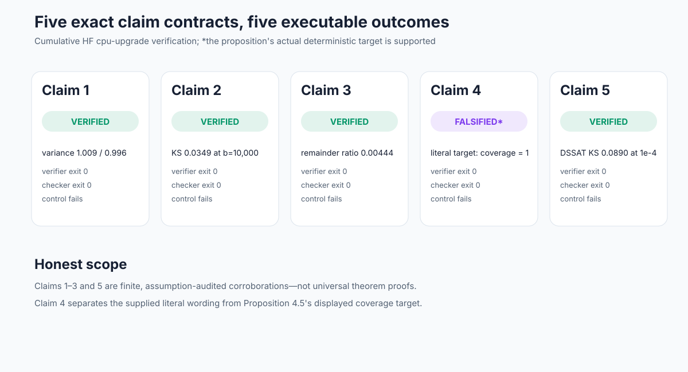
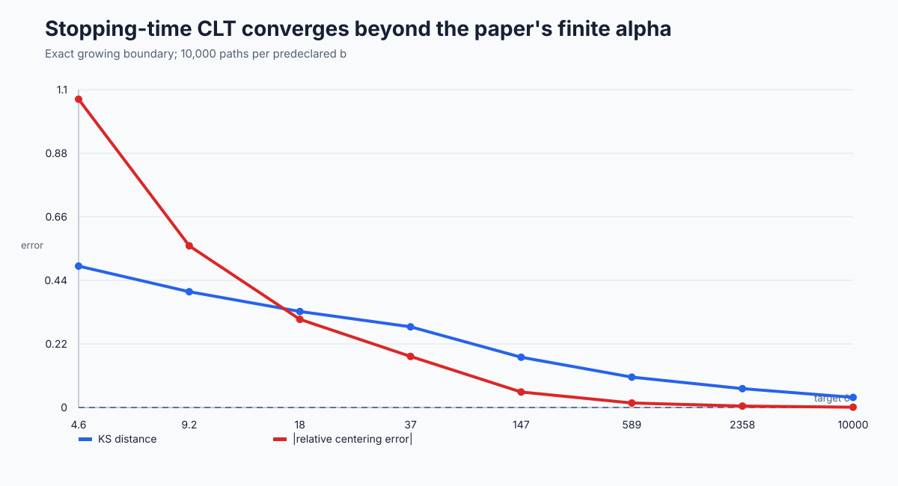
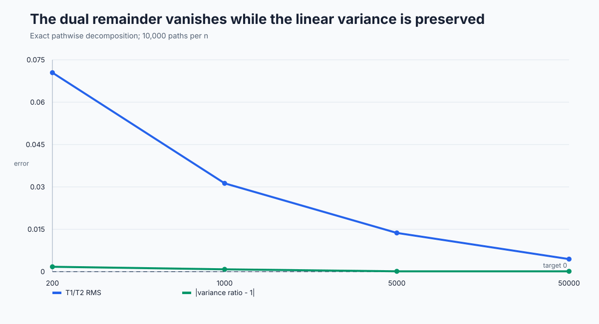
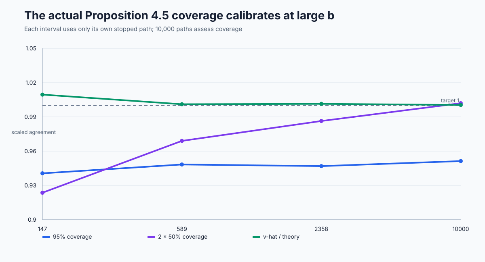
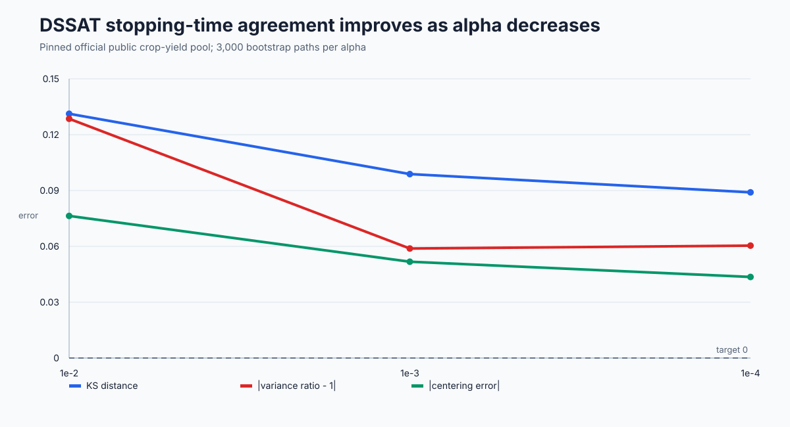

# Beyond first-order asymptotics: a claim-by-claim reproduction



The paper asks a practical question about sequential tests: once the leading-order sample complexity is known, does the *fluctuation* around that limit behave like the claimed Gaussian—and can one estimate its uncertainty from a single stopped path? We reconstructed the bounded-observation `KL_inf` statistic, the exact growing and constant stopping boundaries, the proof decomposition, the single-path plug-in interval, and the paper's synthetic and crop-yield experiments.

The cumulative result is strong but deliberately scoped. Claims 1–3 and 5 are **VERIFIED for explicit finite, assumption-audited contracts**. Claim 4 is **FALSIFIED as literally supplied** because Proposition 4.5's displayed coverage target is the deterministic `1/KL_inf`, not the observed random stopping time; the proposition's actual formula is strongly supported. Finite Monte Carlo evidence does not replace the paper's universal asymptotic proofs.

## What was implemented

The core path follows the paper rather than a proxy:

1. solve the bounded-law dual optimization defining `KL_inf`;
2. evaluate the fixed-sample centered statistic or advance each path to its first boundary crossing;
3. compute the paper's limiting variance, decomposition terms, or stopped-path plug-in variance;
4. retain every raw replicate needed to check first-hit inequalities and replay deterministic seeds;
5. run a separate checker and a control designed to fail for each claim.

All variants inherit the same command and lockfile:

```bash
uv sync --frozen && .venv/bin/python -m reproduction.run
```

The accepted cumulative run used Hugging Face `cpu-upgrade`, the pinned CPU-only image `ghcr.io/astral-sh/uv:0.8.3-python3.12-bookworm-slim@sha256:74b8fe8ec5931f3930cfb6c87b46aeb1dbd497a609f6abf860fd0f4390f8b040`, an estimate of two useful cores, actual affinity to 64 CPUs, and no GPU. The final figure-producing double run took 300.21 seconds of research code inside a 5m28s job.

## Claim outcomes

| Claim | Paper target | Observed evidence | Assessment |
| --- | --- | --- | --- |
| 1 | Fixed-sample `KL_inf` CLT | At `n=5000`, Beta/Bernoulli variance ratios `1.0093/0.9957`, KS `0.0124/0.0185`, coverage `0.9530/0.9522` | VERIFIED, finite contract |
| 2 | Stopping-time CLT as alpha decreases | At `b=10000`, variance `0.9923` with interval `[0.9654,1.0204]`, KS `0.0349`, coverage `0.9477`, center error `0.102%` | VERIFIED, paper setting |
| 3 | Vanishing dual term plus Anscombe transfer | At `n=50000`, remainder/linear RMS `0.00444`, variance ratio `1.000127`; narrow-window exceedance `0.0004/0` | VERIFIED, finite full-prefix contract |
| 4 | “CI for the stopping time” from one run | Literal self-coverage is identically `1`; actual deterministic-target coverage is `0.9513/0.5010` at nominal `95%/50%` | FALSIFIED literally; actual proposition supported |
| 5 | Synthetic and crop-yield numerical agreement | Exact synthetic settings trend correctly; public DSSAT at alpha `1e-4`: KS `0.0890`, variance `0.9396`, Gaussian mass `0.9693` | VERIFIED, declared public-data substitution |

## Where the asymptotic approximation becomes visible

The paper's `alpha=10^-4` stopping-time panel is genuinely pre-asymptotic under the growing boundary: forcing a Gaussian verdict there would reproduce the old logbook's mistake. Instead, we predeclared a wide `b=log(1/alpha)` grid and let the data reveal when the variance, centering, coverage, and KS effect sizes enter their calibration bands.



At `b=10000`, 10,000 paths put the variance ratio's 95% chi-square interval across one, while the KS distance falls to `0.0349`. A deliberately finite-scale control applies the same large-`b` gate at the paper's `alpha=10^-4`; it fails seven checks. A second control substitutes the fixed-sample variance and yields ratio `17.8145`.

## The proof mechanism is observable path by path

The normalized statistic was split exactly into the optimized-dual remainder `T1` and empirical-mean term `T2`. The identity error stayed at machine precision, while the relative RMS of `T1` fell by a factor of 15.8.



The previously missing Anscombe check used every integer prefix in each relative window, not sparse checkpoints. For `delta=0.01`, `epsilon=0.35`, the exceedance probabilities at `n=10000` and `50000` were `0.0004` and `0`, with Wilson upper bounds far below the preregistered `eta=0.1`. A wide-window control fails at probability `0.9252`, showing that the checker is sensitive to the window quantifier.

## The single-run interval needs the right target

Proposition 4.5 centers an interval at the observed `tau_alpha/log(1/alpha)`, but its coverage event contains the deterministic `1/KL_inf(q,m0)`. Calling it an interval for its own random center makes coverage tautologically one. That exact source distinction is the Claim 4 falsification—not a failed Monte Carlo run.



For the proposition's actual target, each interval used only its own stopped observations. At `b=10000`, the mean and median plug-in variance ratios were `1.00043` and `1.00016`; Wilson intervals around the empirical 95% and 50% coverage contained both nominal targets. Using `KL_inf^2` instead of the displayed `KL_inf^3` drops nominal-95% coverage to `0.7770`.

## Crop-yield evidence and the unavoidable substitution

The authors did not publish the exact DSSAT records, normalization, code, or seed behind Figure 5. We therefore did not claim an exact panel match. The replacement is a pinned, primary-source pool from `DSSAT/dssat-csm-data@a4f95d3`: all nonnegative observed `HWAM` entries in ten official Maize A-files, including zero and excluding documented negative missing sentinels. This yields 44 observations from eight files, normalized by the pool maximum.



The exact paper protocol—sampling with replacement, constant `log(1/alpha)` boundary, `m0=0.5`, 3,000 paths—was run at the paper level and two prespecified diagnostics. KS improves strictly as alpha decreases; centering and variance error improve as well. Retaining the negative DSSAT sentinels violates the paper's `[0,1]` domain, while substituting fixed-sample variance produces ratio `52,481.94`; both controls fail as intended.

## Reproducibility and remaining risk

The public candidate exposes claim contracts, source and assumption audits, executable source, locked dependencies, raw CSV/JSON, independent checkers, controls, seeds, Git revisions, CPU/runtime records, and nonzero-exit verifiers. Historical judged pages remain reachable as exact snapshots and are labeled **Historical rejected baseline**.

The conservative score forecast is **6–10**, not a result; the best-supported possible score is **10/10**, also only a forecast. Claim 3 remains finite evidence rather than a machine-checkable universal proof, and Claim 5 cannot match an undisclosed author dataset exactly. Only the live evaluator can change the judged score from `3/10`.

Experiment lineage: [fixed-sample baseline](https://github.com/MachineLearning-Nerd/icml26-repro-HMyCBL2yMV-beyond-first-order-asymptotics-in-sequential-mean-testing/tree/orx/frozen-judged-baseline-claim-1), [calibrated stopping CLT](https://github.com/MachineLearning-Nerd/icml26-repro-HMyCBL2yMV-beyond-first-order-asymptotics-in-sequential-mean-testing/tree/orx/claim-2-calibrated-stopping-time-clt), [decomposition and Anscombe](https://github.com/MachineLearning-Nerd/icml26-repro-HMyCBL2yMV-beyond-first-order-asymptotics-in-sequential-mean-testing/tree/orx/claim-3-decomposition-and-anscombe), [single-run intervals](https://github.com/MachineLearning-Nerd/icml26-repro-HMyCBL2yMV-beyond-first-order-asymptotics-in-sequential-mean-testing/tree/orx/claim-4-single-run-confidence-intervals), [DSSAT repair](https://github.com/MachineLearning-Nerd/icml26-repro-HMyCBL2yMV-beyond-first-order-asymptotics-in-sequential-mean-testing/tree/orx/repair-claim-5-stopped-draw-evidence), and [accepted cumulative render](https://github.com/MachineLearning-Nerd/icml26-repro-HMyCBL2yMV-beyond-first-order-asymptotics-in-sequential-mean-testing/tree/orx/repair-concise-release-evidence-stream).
